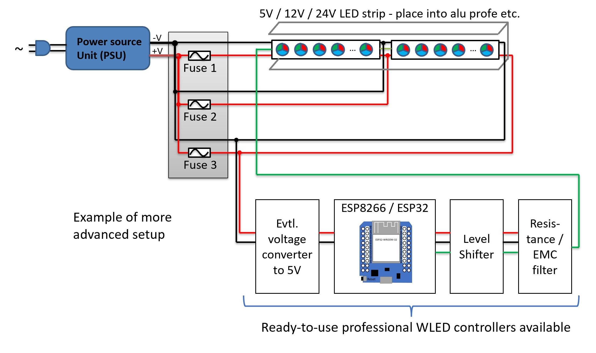
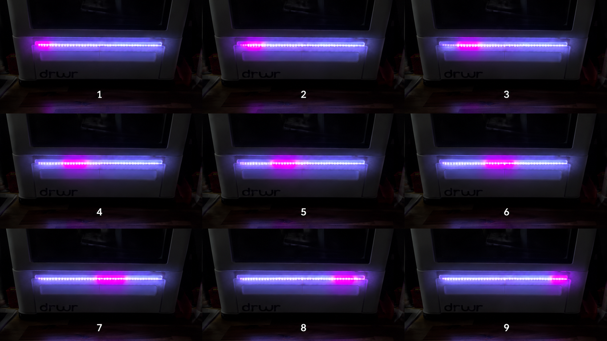
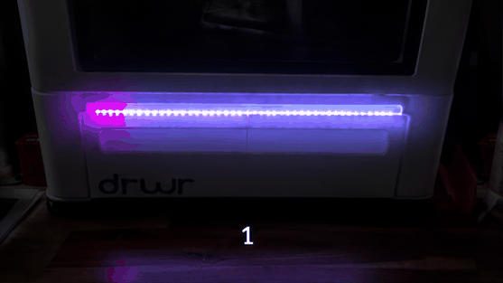
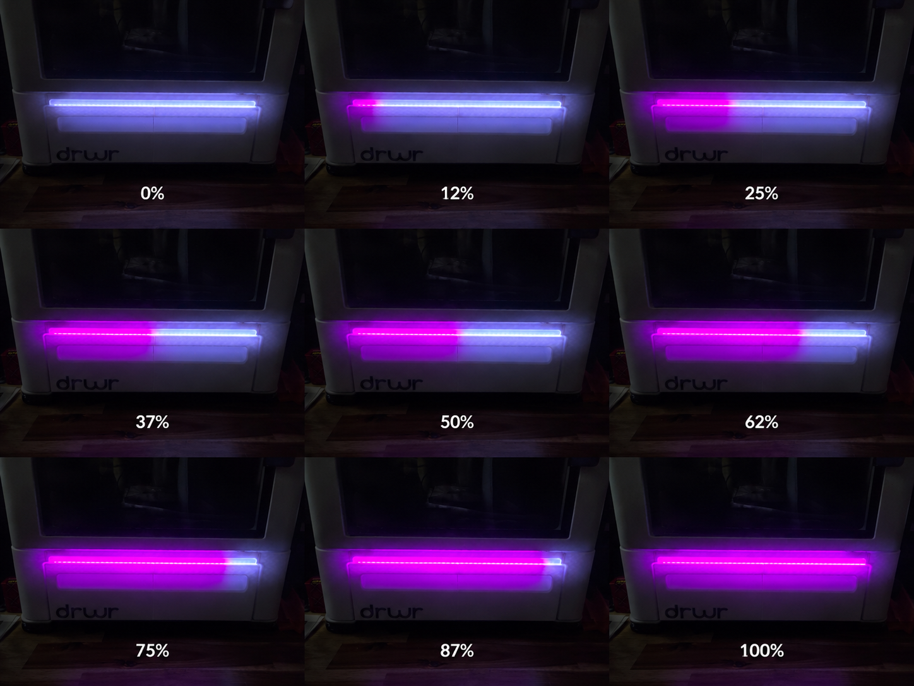
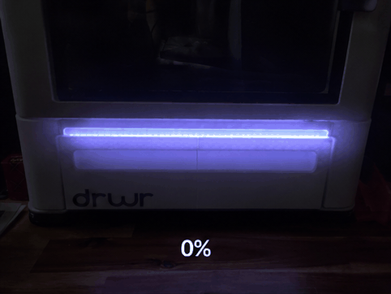

# SnapStatus V2

SnapStatus V2 is a WLED-based status display for the Snapmaker U1 that uses Moonraker integration to display printer activity on addressable RGB LEDs.

This project is a major rework of the original SnapStatus concept, with a focus on easier setup, improved usability, configurable colors directly from the WLED interface, and simple OTA firmware updates.

To make edits to my source code you will have to refer to WLED source files on instructions on how to do so this is specificaly for just the usermod.
---

# Features

* Snapmaker U1 printer status monitoring
* Moonraker integration
* OTA firmware installation
* User-configurable status colors directly from WLED
* Idle status animations
* Print progress display
* Pause status indication
* Print complete indication
* Preheat status animations
* Heating fallback status animations
* Automatic configuration saving through WLED

---

# Acknowledgements

## WLED

SnapStatus V2 is built on top of WLED, the open-source ESP8266/ESP32 LED controller project created and maintained by the WLED community.

WLED Project:
https://github.com/Aircoookie/WLED

---

## WLED v2 Klipper Percentage Usermod

This project incorporates concepts and functionality derived from the WLED v2 Klipper Percentage usermod, which provided the original Moonraker/Klipper status integration framework used as the starting point for this project.

---

## Original SnapStatus Project

SnapStatus V2 was inspired by the original U1-SnapStatus project created by drc85.

Original Project:
https://github.com/drc85/U1-SnapStatus

The original project demonstrated the concept of using WLED and Moonraker integration to display Snapmaker printer status on addressable LEDs. While SnapStatus V2 has been extensively modified and expanded, credit is due to the original author for creating and sharing the original implementation.

Thank you to drc85, the WLED developers, and the community members whose work helped make this project possible.

---

# Tested Hardware

## Controller

Developed and tested using:

* AITRIP ESP32 ESP-WROOM-32 Development Board
* USB-C Connection

## LED Types

Tested using:

* BTF-LIGHTING WS2812B RGB LED Strip
* Total LEDs: 43

Additional WLED-supported LEDs may also work, including:

* WS2812B
* SK6812
* WS2811

## Tested Configuration

* AITRIP ESP32 ESP-WROOM-32 Development Board
* WLED 0.16.x
* Snapmaker U1
* Moonraker Port 7125
* BTF-LIGHTING WS2812B RGB LED Strip

## Power

SnapStatus V2 was developed and tested using USB-powered ESP32 hardware without a dedicated LED power supply.

For small LED installations, the ESP32 may be able to power the LEDs directly through USB power.

For larger LED counts, an external power supply is recommended following normal WLED power guidelines here: https://kno.wled.ge/basics/compatible-controllers/

Just because im using the esp32 to power the lights doesn't make it right please refer to the "Power Notice in the Disclaimer section near the bottom 

## Wiring Example

## WLED Configuration

* After booting up your board with WLED Set it up to your desired GPIO pin making sure it is changed in the wled settings "LED & Hardware"
* I am using 43 LED's on my strip make sure to update this setting to accuratly depict your own LED count.
* Here is my settings, please use this as a guide and not 100% your GPIO and led count may differ depending on your instalation:
* Maximum PSU Current: 800mA
Use per-output limiter: NA

LED outputs:
1:WS281x

mA/LED: 
55mA (typ. 5V WS281x)

Color Order: 
GRB
Start: 0
Length: 43

Data GPIO: D2/2

Reversed: NA
Skip first LEDs: 
0

Off Refresh: NA 

## Printer IP
After following the install steps below to step #5 input your printers info in as below:

Enter only the printer IP address.

Correct:

20.0.0.100

112.111.1.10

Do NOT enter:

http://20.0.0.100

https://20.0.0.100

20.0.0.100:7125

snapmaker.local

## Moonraker Port

Default:

7125

Only change this if your Moonraker installation uses a different port.

## API Key

Leave blank unless your Moonraker installation requires an API key.

---

# Installation

## Step 1

Install and configure WLED on a compatible ESP32 controller using WLED website: https://install.wled.me/

## Step 2

Download the latest SnapStatus V2 firmware from the Releases section of this repository.

## Step 3

Open your WLED device.

Navigate to:

Config → Security & Updates → Manual OTA Update

## Step 4

Upload the SnapStatus V2.0.0 firmware file.

Wait for WLED to update and reboot.

## Step 5

Navigate to:

Config → Usermods → SnapmakerU1

Enter your printer information and save.

WLED will automatically reboot after saving changes.

---

# Color Configuration

All color values use RGB channels.

Range: 0-255

If you go above or below this range it will default to 0

Example: #FF00C8

R = 255

G = 0

B = 200

## Hex to RGB
You can always use an online program to turn your hex code to rgb values you can then input into your setup

(Note depending on your rgb strip and its limitations colors are not perfect)

https://htmlcolorcodes.com/color-converter/?utm_source=chatgpt.com 

## Color Guide

| Setting         | Description                                |
| --------------- | ------------------------------------------ |
| Idle Color A    | Moving idle wipe color                     | 
| Idle Color B    | Idle background color                      |
| Print Color     | Filled portion of the progress bar         |
| Remaining Color | Unfilled portion of the progress bar       |
| Pause Color     | Paused pulse color                         |
| Complete Color  | Print-complete blink color                 |
| Preheat Color A | Dim side of preheat breathing animation    |
| Preheat Color B | Bright side of preheat breathing animation |
| Heating Color A | First side of heating fallback blend       |
| Heating Color B | Second side of heating fallback blend      |

## Idle Animation

## Print Progress

### Error State

The error state is intentionally fixed red and is not user configurable.

---

# Troubleshooting

## Printer Not Connecting

Verify:

* Printer IP is correct
* Moonraker is running
* Port number is correct
* Printer and WLED device are on the same network

## Configuration Not Saving

After saving configuration changes, WLED should automatically reboot.

Allow the device to reconnect before testing.

## LEDs Not Responding

Verify:

* LED type is configured correctly in WLED
* Data line is connected properly to your designated GPIO pin set up in WLED settings
* LED count is configured correctly
* Adequate power is available for the number of LEDs installed

---

# Future Plans

Potential future improvements include:

* HEX color entry support
* Additional LED effects
* Additional printer state indicators
* Power on animation
* Expanded hardware testing

---

# Disclaimer
All WLED functions have been turned off to avoid crashes

This project is provided as-is without any warranty, guarantee, or representation of safety, reliability, or suitability for any specific application.

By using, modifying, building, or installing this project, you accept all risks associated with its use. The author assumes no responsibility or liability for any injury, property damage, equipment damage, data loss, fire, electrical failure, printer damage, controller damage, LED damage, or any other direct or indirect consequences resulting from the use of this project.

Users are responsible for verifying all wiring, power requirements, hardware compatibility, and installation procedures before use.

## Power Notice

The hardware configuration used during development and testing may not represent best practices for every installation.

This project was developed and tested using a USB-powered ESP32 controller directly powering a small WS2812B LED installation. While this configuration functioned correctly during testing, it should not be considered a universal recommendation.

Always follow the official WLED hardware and power guidelines when designing your installation.

Official WLED Controller Documentation:

https://kno.wled.ge/basics/compatible-controllers/

Official WLED Hardware Documentation:

https://kno.wled.ge/basics/getting-started/

Power requirements vary based on LED type, LED count, brightness, wiring, power supply capacity, and installation conditions. Larger LED installations may require dedicated power supplies, power injection, fusing, level shifters, and additional safety considerations.

Use this project entirely at your own risk.

--- 
# License

This project follows the licensing requirements of WLED and any incorporated open-source components.
